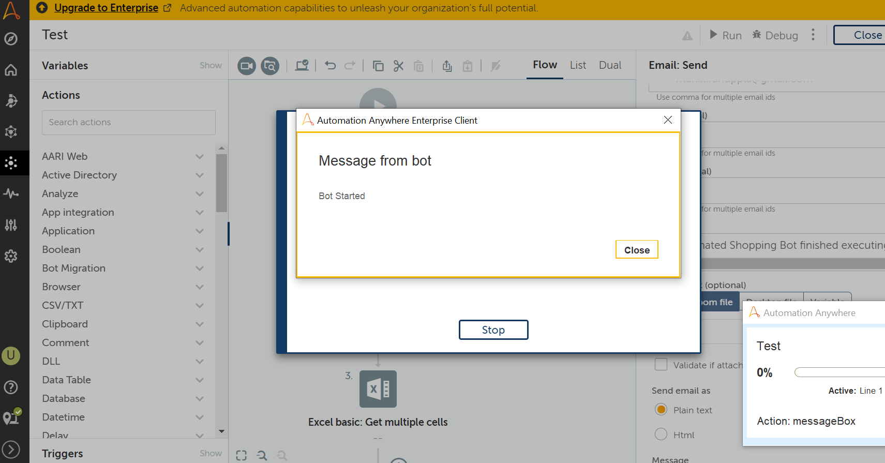
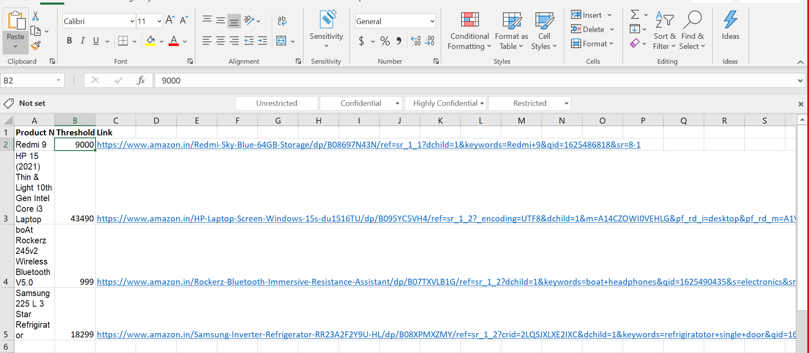
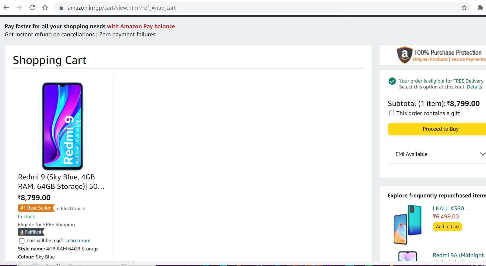
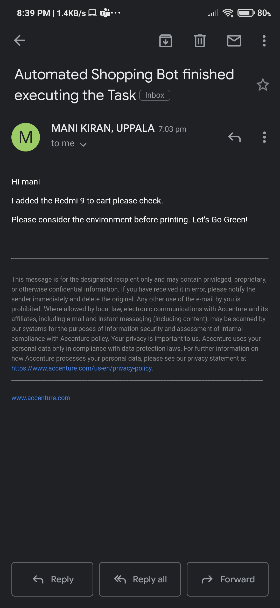
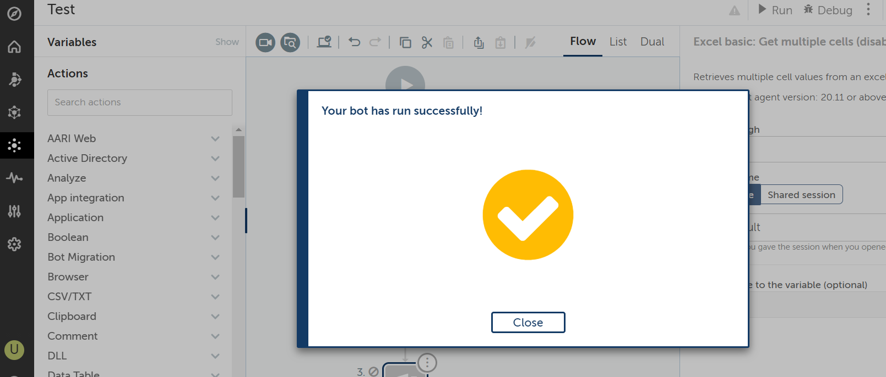

# Automated-Shopping-Bot
This bot is used to do add products to cart when there is price drop with respect to target price. The target price is taken from Excel sheet. It will also notifies the user when there is price drop.

1. BOT STARTED

2. EXTRACTING DATA FROM INPUT EXCEL

3. ADDING PRODUCTS TO CART

4. EMAIL NOTIFICATION TO USER 

5. TASK SUCESSFUL

